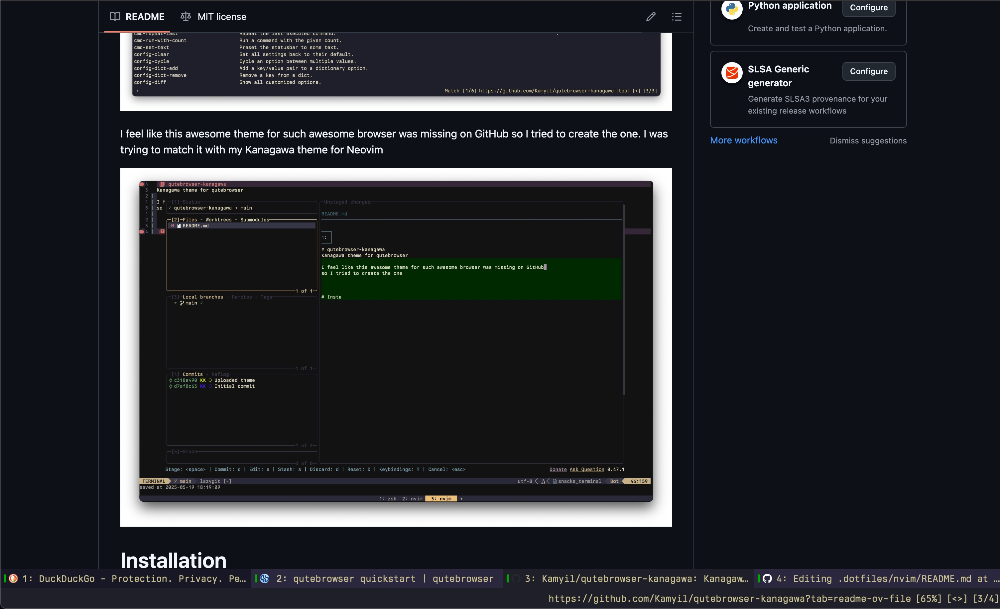

# qutebrowser-kanagawa
Kanagawa theme for qutebrowser




I feel like this awesome theme for such awesome browser was missing on GitHub 
so I tried to create the one. I was trying to match it with my Kanagawa theme for Neovim


# Installation
There is none :) Just copy-paste the contents of theme.py file to your config.py file, 
below the `config.load_autoconfig(False)` line

Make sure that ^ this function is called first!**

# Font
In the pasted code you can spot following commented line

```python
# c.fonts.default_family = "JetBrains Mono"
```

In my opinion theme shouldn't set the font for you, but I leaved it commented here, because it's handy to 
define it in the config. I found this theme greatly working for Berkeley Mono, JetBrains Mono and Fira Code fonts :)
